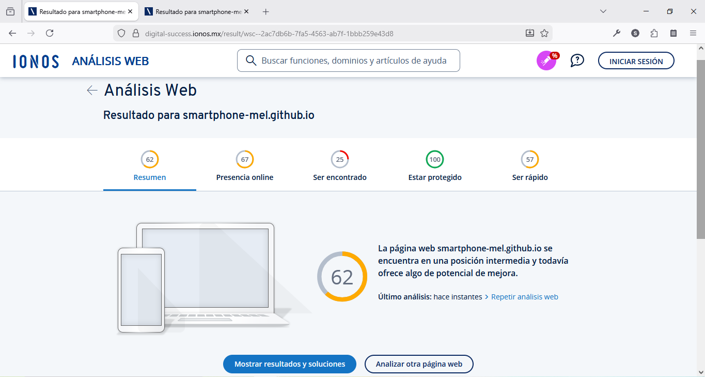
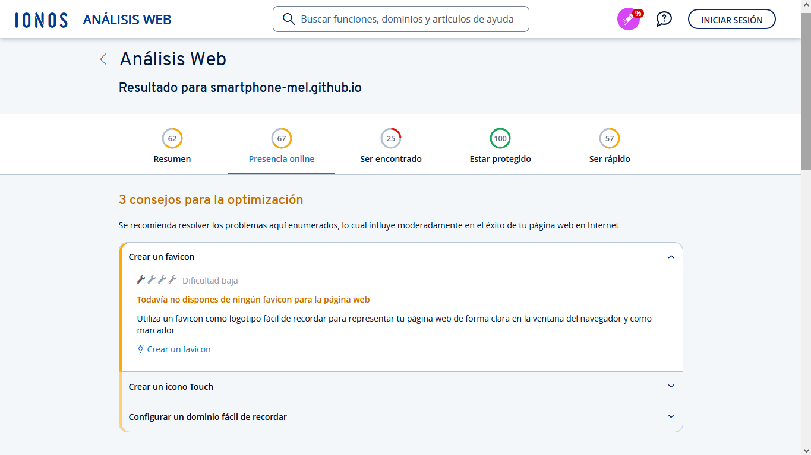
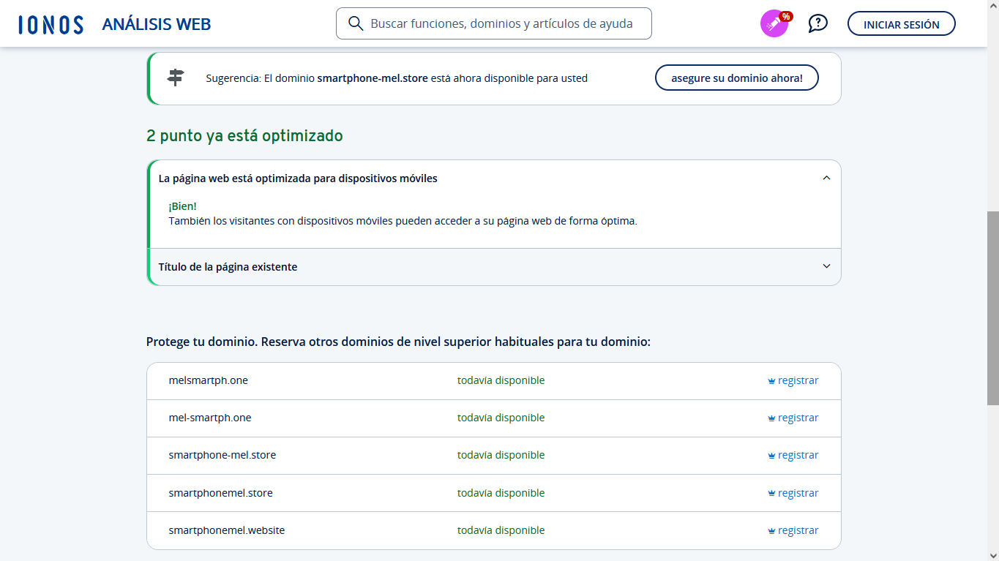

# launching-klassy-cafe-template
Proyecto de Estudio del Diplomado en Gestión de Ambientes Virtuales de Aprendizaje de Fundación Carlos Slim

## IONOS | Análisis Web Gratis: Verificador de Página Web
<a href="https://www.ionos.mx/tools/analisis-web#tool" target="_blank" rel="noopener noreferrer">Análisis Web | IONOS | Link</a>

Aspectos que revisa y verifica el Análisis Web:
* Presentación de la Página
  * Optimizada para Dispositivos Móviles
  * Favicon Disponible
  * Touch-Icon Disponible
  * Título de página Existente
  * Longitud del Dominio
* Visibilidad en Motores de Búsqueda
  * Título de Página
  * Descripción de Página
  * Extensión de Página
  * Medios de Comunicación Social
  * Mapa de Sitio
* Seguridad de la Página
  * Cookies Seguras
  * Cifrado SSL
  * Estado del Servidor Apache
  * Visibilidad de la Versión del Servidor
* Velocidad de la Página
  * Activación de la CDN
  * Tamaño de Página Web
  * Compresión GZIP

Resultados en base a ./sinopsis-launching-klassy-cafe-template/index.html...

